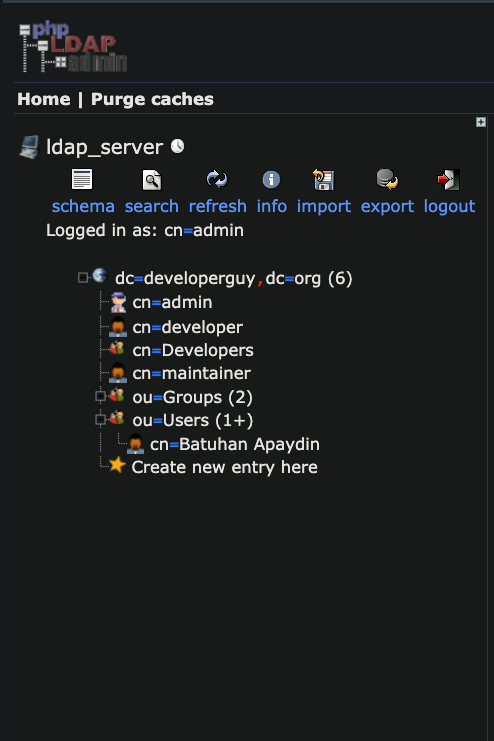

# Description
Demonstration how you can use the Vault LDAP Authentication with the OpenLDAP Server that is running on docker container

# What is Vault LDAP Auth Method ?

The ldap auth method allows authentication using an existing LDAP server and user/password credentials. This allows Vault to be integrated into environments using LDAP without duplicating the user/pass configuration in multiple places.

The mapping of groups and users in LDAP to Vault policies is managed by using the users/ and groups/ paths.

> Credit: https://www.vaultproject.io/docs/auth/ldap

# What is OpenLDAP project ?

The OpenLDAP Project is a collaborative effort to develop a robust, commercial-grade, fully featured, and open source LDAP suite of applications and development tools. The project is managed by a worldwide community of volunteers that use the Internet to communicate, plan, and develop the OpenLDAP Suite and its related documentation.

> Credit: https://www.openldap.org/project/

# Prerequisites
* docker 20.10.2

# Hands-On

The main goal of this demo is we will get a valid token from Vault with our LDAP credentials. To do so, we are going run all of these tools that I mentioned above with a single docker-compose file. So, the only thing that we need is docker. 

Lets look at our [docker-compose file](./docker-compose.yaml) to see what inside
```yaml
version: '3.7'
services:
  ldap_server:
    image: osixia/openldap:1.4.0
    command: ["--copy-service"]
    environment:
      LDAP_DOMAIN: developerguy.org
      LDAP_ADMIN_PASSWORD: test1234
      LDAP_BASE_DN: dc=developerguy,dc=org
    ports:
      - 389:389
    volumes:
      - "./ldif:/container/service/slapd/assets/config/bootstrap/ldif/custom"
  ldap_server_admin:
    image: osixia/phpldapadmin:0.9.0
    ports:
      - 8080:80
    environment:
      PHPLDAPADMIN_LDAP_HOSTS: ldap_server
      PHPLDAPADMIN_HTTPS: 'false'
  vault:
    container_name: vault-container
    image: hashicorp/vault:1.5.4
    ports:
      - 8200:8200
    environment:
      - VAULT_ADDR=http://127.0.0.1:8200
      - VAULT_API_ADDR=http://127.0.0.1:8201
    command: server -dev -dev-root-token-id=root
    cap_add:
      - IPC_LOCK
```

You will notice that there is three container available inside of it, "vault", "ldap server" and "ldap server admin". You will also notice that there is bootstrap file available to be able to feed OpenLDAP server with data.

Lets' start this.
```bash
$ docker-compose up
docker-compose up
Found existing alias for "docker-compose up". You should use: "dcup"
Starting vault-ldap-authentication-method_ldap_server_1       ... done
Starting vault-container                                      ... done
Starting vault-ldap-authentication-method_ldap_server_admin_1 ... done
Attaching to vault-container, vault-ldap-authentication-method_ldap_server_1, vault-ldap-authentication-method_ldap_server_admin_1
...
```

Then go to your browser and open http://localhost:8080 and login with admin credentials


You should see the following schema in that page after the login.


> NOTE: There is a single user available within the [./ldip/bootstrap.ldif](./ldip/bootstrap.ldif) for our demo purpose.

I prepared a script to login Vault with LDAP credentials, lets have a look at this.
```bash
#!/usr/bin/env bash

set -e

# set necessarry environment variables
set_env(){
  export VAULT_ADDR="http://localhost:8200"
  export VAULT_TOKEN="root"
}

# enable LDAP auth method
enble_ldap_auth_method(){
  vault auth enable ldap
}

# configure LDAP auth method
configure_ldap_auth_method(){
  vault write auth/ldap/config \
   url="ldap://ldap_server:389" \
   binddn="cn=admin,dc=developerguy,dc=org" \
   bindpass="test1234" \
   userdn="ou=Users,dc=developerguy,dc=org" \
   userattr="cn" \
   groupdn="ou=Groups,dc=developerguy,dc=org" \
   groupattr="cn" \
   insecure_tls=false
}

# create necesarry policy bindings
create_policy_group_mapping(){
  vault policy write only-read-to-foo ./policy.hcl
  vault write auth/ldap/groups/Maintainers policies=only-read-to-foo
}

# login with ldap
login(){
 echo "Loginning with $@"
 vault login -method=ldap username="$@"
}

main(){
    set_env
    enble_ldap_auth_method
    configure_ldap_auth_method
    create_policy_group_mapping
    login "$@"
}


main "$@"
```

It needs only a username for the user that is going to be login, "Batuhan Apaydin" in this case.

Lets' run it.
```bash
$ sh main.sh "Batuhan Apaydin"
Password (will be hidden): <-- 12345
WARNING! The VAULT_TOKEN environment variable is set! This takes precedence
over the value set by this command. To use the value set by this command,
unset the VAULT_TOKEN environment variable or set it to the token displayed
below.

Success! You are now authenticated. The token information displayed below
is already stored in the token helper. You do NOT need to run "vault login"
again. Future Vault requests will automatically use this token.

Key                    Value
---                    -----
token                  s.onVUJ55PAZx6ubqglK1syzGP
token_accessor         jtxsseanTs8OUr4sBNu3zp05
token_duration         768h
token_renewable        true
token_policies         ["default" "only-read-to-foo"]
identity_policies      []
policies               ["default" "only-read-to-foo"]
token_meta_username    Batuhan Apaydin
```

You should see the similar output above and you are ready to login to Vault with this credentials.
```bash
$ vault login -method=token
Token (will be hidden):  <-- s.onVUJ55PAZx6ubqglK1syzGP
```
